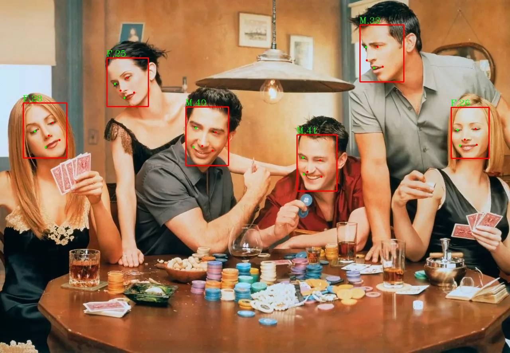

# InsightFace 学习笔记


## 简介

InsightFace 是一个人脸识别的工具箱，主要基于 PyTorch 和 MXNet

[官网](https://insightface.ai/)

[github](https://github.com/deepinsight/insightface)

InsightFace Python 库的代码是在 MIT 许可下发布的。学术和商业用途都没有限制。

随此库提供的预训练模型仅可用于非商业研究目的，包括自动下载模型和手动下载模型。

## 依赖

- python3
- anaconda3
- pytorch
- mxnet

## 安装

```shell
# -U：升级。原来已经安装的包，带上U才会更新到最新版本，不带U不会装新版本。
# 最好可以把源切到阿里的源，因为阿里的源比较好，更新速度更快。
pip install -U Cython cmake numpy

pip install -U insightface

pip install -U onnxruntime

pip install -U mxnet
```

## 运行

```python
import cv2  # 导入opencv库
import numpy as np  # 导入numpy库
import insightface  # 导入insightface库
from insightface.app import FaceAnalysis  # 导入FaceAnalysis类
from insightface.data import get_image as ins_get_image  # 导入get_image函数

# 创建FaceAnalysis类对象
app = FaceAnalysis(providers=['CUDAExecutionProvider', 'CPUExecutionProvider'])
app.prepare(ctx_id=0, det_size=(640, 640))  # 准备模型
img = ins_get_image('t1')  # 获取图片
faces = app.get(img)  # 获取人脸
rimg = app.draw_on(img, faces)  # 在图片上画人脸
cv2.imwrite("./t1_output.jpg", rimg)  # 保存图片
```

## 输出



## 模型

### 默认模型

app = FaceAnalysis()对于 insightface>=0.3.3，一旦我们初始化实例，模型将自动下载。并放在~/.insightface/models/这个目录下

### 自定义模型

调用 app = FaceAnalysis(name='your_model_zoo') 去加载你的模型

#### 模型格式

最新的 insightface 库仅支持 onnx 模型。一旦你通过 PyTorch、MXNet 或任何其他框架训练了检测或识别模型，就可以将其转换为 onnx 格式，然后可以使用 insightface 库调用它们。

## 参考

https://github.com/deepinsight/insightface/tree/master/python-package
